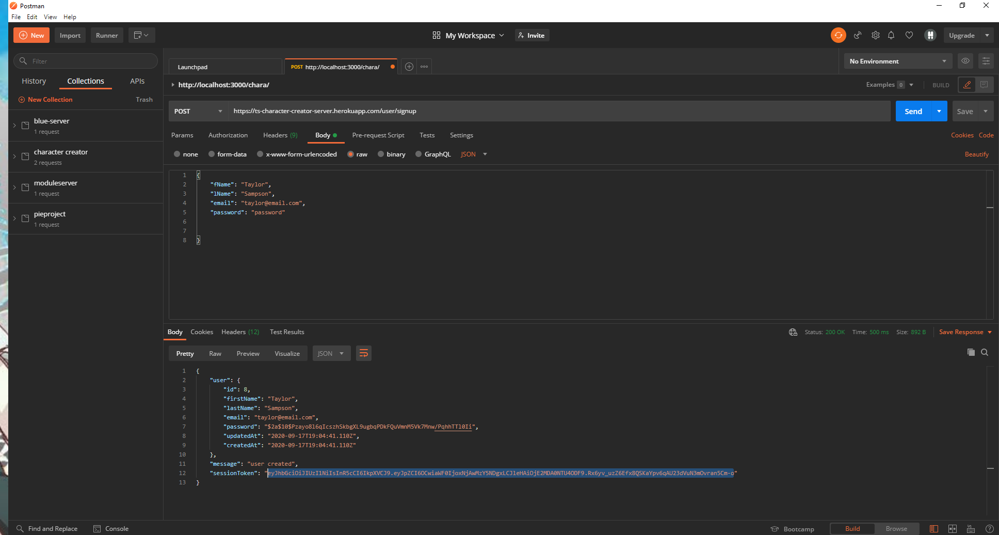

# Character Cache

## Below Images are to showcase Endpoints and Routes.

#### 1. https://ts-character-creator-server.herokuapp.com/user/signup -POST-Allows a new user to be created with a username and password.

#### 2. https://ts-character-creator-server.herokuapp.com/user/signin -POST-Allows log in with an existing user email and password.

#### 3. https://ts-character-creator-server.herokuapp.com/chara/ -POST-Allows users to create a Character with Name, Species, Age, and Description.

#### 4. https://ts-character-creator-server.herokuapp.com/chara/ -GET-Gets all Characters for an individual user.

#### 6. https://ts-character-creator-server.herokuapp.com/chara/:id -PUT-Allows individual Character to be updated by an ID.

#### 7. https://ts-character-creator-server.herokuapp.com/chara/:id -DELETE-Allows individual Character to be deleted by an ID.

#### 8. User Database Table

#### 9. Character Database Table

